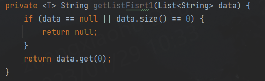

<T>和T  
https://www.cnblogs.com/jpfss/p/9929108.html  
这个讲的最全 
https://blog.csdn.net/weixin_52772307/article/details/126868855

<T> T ,T ,<T>,三者的区别 

补充: 
     
    这里的<T> 表示可以传入T类型的参数，也可以不传入 
    比如: 
        
  
泛型的学习大概是两种  
*     泛型方法  
*     泛型类  
    
